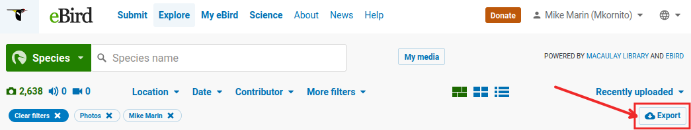

# PhotoGap4eBird

This tool identify birds without a photo by comparing two eBird CSV files — one containing the lifelong list of observed bird species and the other the list of species with photos.

To use this tool you need to get the two CSV files by exporting them from your account on [eBird](https://ebird.org/home). Then you can execute this tool to produce a third file with the list of bird species that don't have photos. The process is explained below.

## Requirements

This tool (`PhotoGap4eBird.py`) works in most operating systems, namely Windows, Linux and Mac. But, you need to have Python 3 installed. You can check by doing the following in the command line:

```
python --version
```
That should indicate a version of 3 or greater. If you get an error then you need to install Python. Alternatively you can try with Python 3:

```
python3 --version
```
If you have Python and it is a version greater or equal to 3, then you are OK,

In linux you need to make `PhotoGap4eBird.py` executable, with the following command:

```
chmod +x PhotoGap4eBird.py
```

Now you are ready to follow the process.

## Process

The process has two parts, first you need to export the two input CSV files and then you need to generate the third CSV file with the bird species for which you need photos.

### Export the CSV files from eBird 

1- Login into your [eBird](https://ebird.org/home) account and in the first page, you should select 'My eBird'.


2- You will arrive at the World page. In there click on the 'Species observed'.


3- You will arrive to the 'World Life List' page and click on 'Download (csv)'. That will download a file called 'ebird_world_life_list.csv' that contains all the species you have observed.


4- Go back to the 'My eBird' page, and then click in 'Species with photos'


5- Which will take you to your pictures, in that page click on 'Export'. This will download a new csv file with a row for each photo you have contributed.



6- Place those two files in the same directory (folder). The next step can be simplified if you place the files in the same directory (folder) in which you have the tool `PhotoGap4eBird.py`.

### Executing PhotoGap4eBird

Executing `PhotoGap4eBird.py` with the -h option will list the program arguments, as follows:

    usage: PhotoGap4eBird.py [-h] -p PHOTO_FILE [-l LIFE_LIST_FILE] [-m MISSING_PHOTOS_FILE]
    Compare 2 eBird csv files (the world life list and the list of birds with photos) to identify birds without photos

    optional arguments:
      -h, --help            show this help message and exit
      -p PHOTO_FILE, --photo-file PHOTO_FILE
                        exported file with list of photos (required)
      -l LIFE_LIST_FILE, --life-list-file LIFE_LIST_FILE
                        exported world life list (optional)
      -m MISSING_PHOTOS_FILE, --missing-photos-file MISSING_PHOTOS_FILE
                        output csv file (optional)

#### Example
Let assume that you exported the following files from eBird `ebird_world_life_list.csv` and `ML__2023-09-23T20-29_photo_USER00.csv` and you place them in the same directory (folder) in which `PhotoGap4eBird.py` resides, then you can execute it as follows:

    PhotoGap4eBird.py -p ML__2023-09-23T20-29_photo_USER00.csv

That will produce an output file named `missing_photos.csv`

